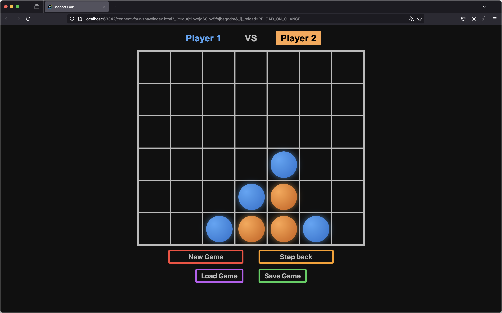
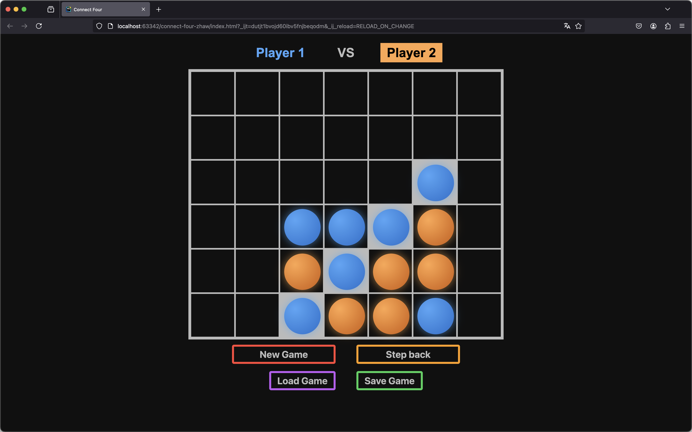
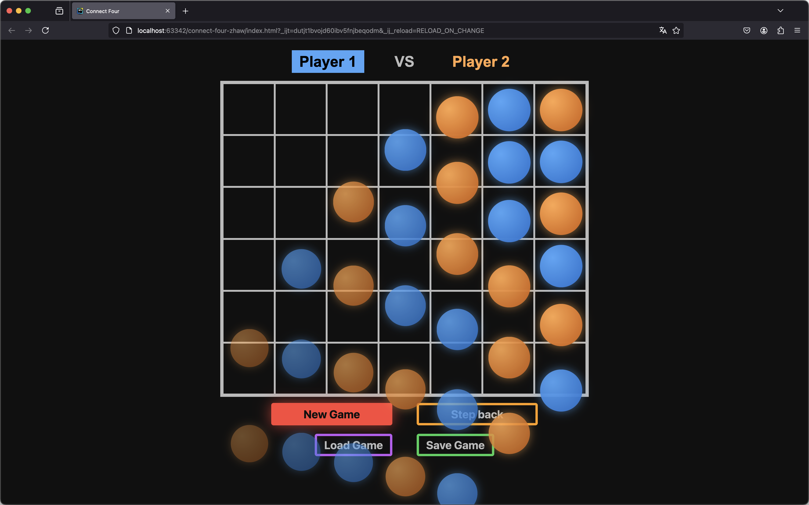

# Connect Four Game 🎮
A modern and interactive implementation of the classic Connect Four game! This project was developed as part of the **Web Development Module** at the **ZHAW** with the guidance of our lecturer **Patrick Baumgartner**.

---

## 🌟 Features
- **Dynamic Board Resizing**: Adapts perfectly to different screen sizes for desktop and mobile users.
- **Interactive Gameplay**: Play against a friend (on the same device) and see the winning combination highlighted upon victory.
- **Undo Functionality**: Step back a move and replay with a different strategy.
- **Save/Load Game**: Save the current game state and load it later to continue playing using the Local Storage in your browser.
- **Engaging Animations**: Enjoy fun piece drop animations and other visual effects.
- **Clean Code**: Implements non-destructive updates for state management.

---

## 📸 Screenshots

  
*The game board showing Player 1 and Player 2.*

  
*Winner highlighted*


*New game animation*

---

## 🚀 Live Demo
Check out the live version on GitHub Pages:  
**[Play Connect Four](https://sagittarius-codebase.github.io/connect-four-zhaw/)**

---

## 📂 Repository
Explore the source code on GitHub:  
**[GitHub Repository](https://github.com/sagittarius-codebase/connect-four-zhaw)**

---

## 🛠️ Technologies Used
- **HTML, CSS, JavaScript**: Core technologies for building the game.
- **SuiWeb Library**: A lightweight framework used for handling state and rendering, developed at ZHAW.

---

## 🎓 About the Project
This project was part of the Web-Development module at ZHAW (University of Applied Science Zurich). Key goals included:
1. Practicing modern JavaScript techniques.
2. Using a lightweight framework for component-based development.
3. Managing application state with immutable data structures.

### Component-Based Workflow and Direct DOM Manipulation
While the game primarily uses a **component-based workflow** (e.g., in `showBoard` for rendering the game board), animations and dynamic elements are managed directly using the `elt` function. This mixed approach allows for:
- **Built-in and exit animations**: Smooth animations when pieces drop or are removed from the board.
- **Performance optimization**: Avoiding unnecessary re-renders by directly manipulating the DOM for specific events.

This design balances modularity with performance, ensuring both maintainable code and an engaging user experience.

---

## 🖥️ How to Run Locally
1. Clone the repository:
   ```bash
   git clone https://github.com/sagittarius-codebase/connect-four-zhaw.git
    ```
2. Navigate to the project directory:
   ```bash
   cd connect-four-zhaw
    ```
3. Open the `index.html` file in your browser.

## 📄 License
This project is licensed under the MIT License - see the [LICENSE](LICENSE) file for details.